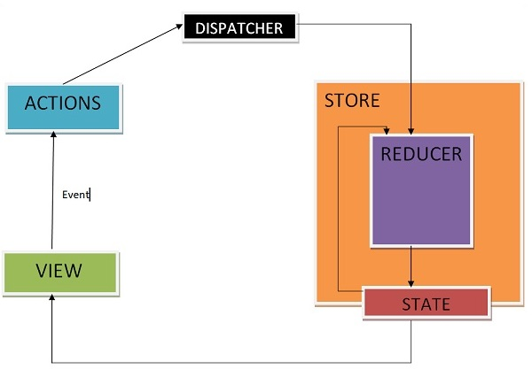

# React + Redux Overview with Diagrams

## Introduction

**React** is a JavaScript library for building user interfaces with reusable components. It handles local state well for small apps, but as complexity grows, managing state across components becomes challenging.

**Redux** centralizes application state in a single store, enabling predictable updates and easier data sharing between components.

This README uses diagrams to visually explain key concepts and the data flow in React + Redux.

## Core Concepts of Redux

Redux revolves around a unidirectional data flow. Here's a visual overview of the main components:


1. **Store**
   - The single object holding the entire application state.
   - Created with a reducer and initial state.
   - Example:
     ```ts:disable-run
     import { createStore } from 'redux';
     const store = createStore(rootReducer, initialState);
     ```

2. **State**
   - The data structure in the store, often an object.
   - Components subscribe to changes via React Redux hooks like `useSelector`.

3. **Actions**
   - Objects that describe events or changes.
   - Example:
     ```ts
     { type: 'INCREMENT', payload: 1 }
     ```

4. **Reducers**
   - Pure functions that compute new state based on current state and action.
   - Example:
     ```ts
     function counterReducer(state = { count: 0 }, action) {
       switch (action.type) {
         case 'INCREMENT':
           return { count: state.count + action.payload };
         default:
           return state;
       }
     }
     ```

5. **Dispatch**
   - Sends actions to the store to trigger updates.
   - Example with React Redux:
     ```ts
     const dispatch = useDispatch();
     dispatch({ type: 'INCREMENT', payload: 1 });
     ```

6. **Selectors**
   - Extract specific state slices.
   - Example:
     ```ts
     const count = useSelector(state => state.counter.count);
     ```

## Why Use Redux with React?

- Simplifies state management in large apps by avoiding prop drilling.
- Ensures predictable behavior through immutable updates.
- Integrates seamlessly with React via `react-redux` for connecting components to the store.

## React + Redux Data Flow

The flow is unidirectional: actions are dispatched from components, processed by reducers, and the updated state flows back to the UI.

Here's a detailed diagram illustrating the React + Redux data flow:


### Step-by-Step Workflow

1. **User Interaction**: A user clicks a button in a React component, triggering an event handler.
2. **Dispatch Action**: The component dispatches an action to the store.
3. **Reducer Processes**: The reducer receives the action and returns a new state.
4. **Store Updates**: The store notifies subscribed components of the change.
5. **UI Re-renders**: Components read the new state and update the view.

Another simple view of the flow:



## Example Flow in Code

Consider a simple counter app:

- **Action Dispatch**:
  ```ts
  // In a component
  dispatch({ type: 'INCREMENT', payload: 1 });
  ```

- **Reducer Update**:
  ```ts
  // Reducer handles it
  { count: 0 } → { count: 1 }
  ```

- **Component Reads State**:
  ```ts
  const count = useSelector(state => state.counter.count);
  // Renders: <p>Count: 1</p>
  ```

## Best Practices

- Use Redux Toolkit to reduce boilerplate (e.g., `configureStore`, `createSlice`).
- Keep actions and reducers focused on single concerns.
- Combine reducers for modular state management.
- Use middleware like Redux Thunk for async operations.
- Debug with Redux DevTools for time-traveling through state changes.

## Conclusion
```
React + Redux provides a robust architecture for scalable apps. The diagrams above highlight the predictable, one-way data flow that makes debugging and maintenance easier. For hands-on learning, try building a simple todo app with these concepts!
```